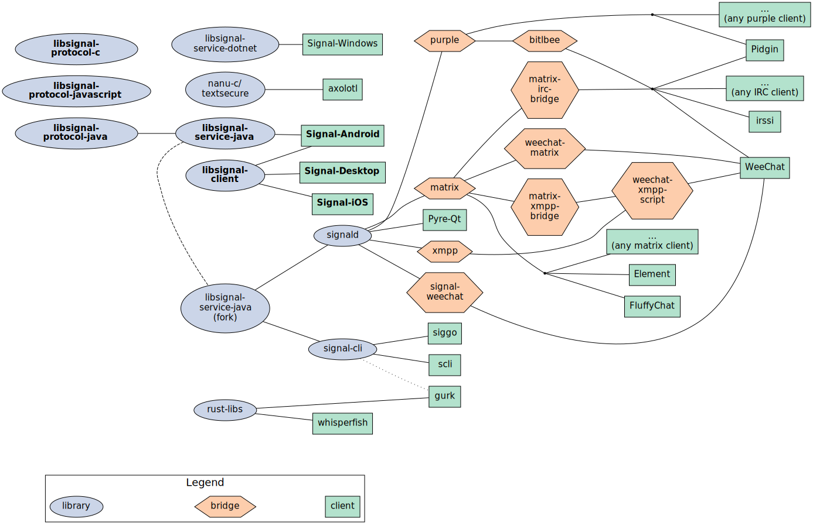

Listing third-party libraries and clients for the [Signal](https://signal.org/) messenger.

The full list is on the [**wiki**](https://github.com/exquo/signal-libs/wiki).

### What

Signal does not have an official API, and the [published code](https://github.com/signalapp/) requires additional effort to be used outside of the official signal clients.

There are several options available if you are building a program that communicates through signal, or if are looking for an alternative to an official signal client. In fact, the  number of choices and the chains of dependencies might be a bit overwhelming (see the mock [diagram]() below).

This list is an attempt to collect all the useful information on the unofficial signal tools.

### Why

Some use-cases for third-party clients and libraries:

- Platforms and architectures not supported by the official clients: BSD, Sailfish OS, Linux on non-x64 or low-resources devices, etc.
- Registering an account without an Android or an iPhone.
- An alternative to an [Electron](https://www.electronjs.org/) app (base for the desktop client).
- Bridges or plugins in multi-protocol messaging clients (Pidgin, Matrix, WeeChat, etc).
- Bots, clients on headless servers, etc.

See also the [wiki's use-cases page](https://github.com/exquo/signal-libs/wiki/Use-cases).

### Which

See [**wiki**](https://github.com/exquo/signal-libs/wiki) for the full list.

Illustrating the number of the available options and their dependency paths:

